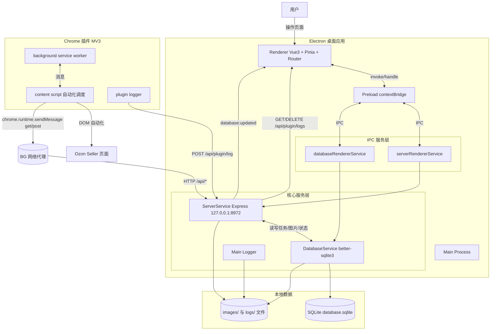
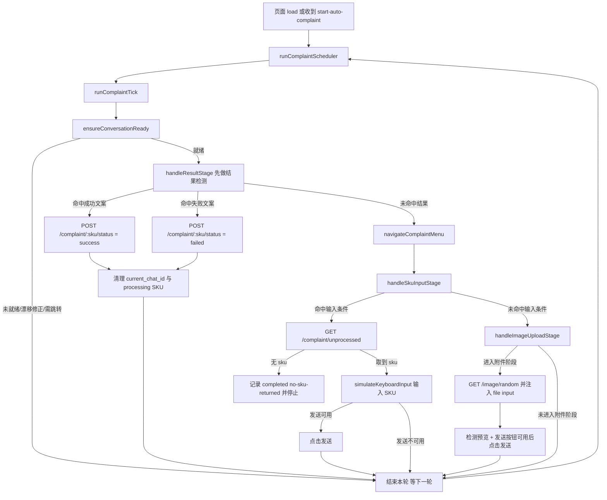
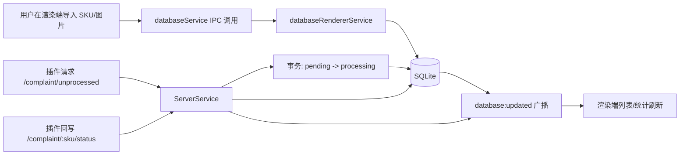
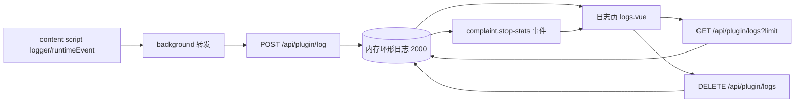

# OzonAssist 架构图与流程图

本文基于当前代码实现生成，覆盖桌面端、插件端、本地 API 与自动投诉执行主流程。

## 1) 系统完整架构图

## 2) 自动投诉执行流程图（端到端）

## 3) 数据导入与任务状态流

## 4) 插件日志与可观测性流程

## 5) 模块与职责速览

- 桌面主进程: 窗口生命周期、Express 本地 API、SQLite、系统通知。
- 渲染进程: 投诉管理、图片管理、运行配置、日志监控。
- 预加载层: 暴露受控 IPC 通道。
- 插件 Background: 右键菜单、消息中继、HTTP 代理。
- 插件 Content Script: Ozon 页面 DOM 自动化执行与结果判断。

## 6) 关键接口清单

- GET /api/status
- GET /api/complaint/unprocessed
- POST /api/complaint/:sku/status
- POST /api/complaint/:sku/image
- GET /api/image/random
- POST /api/plugin/log
- GET /api/plugin/logs
- DELETE /api/plugin/logs
- GET /api/plugin/runtime-config
- POST /api/plugin/runtime-config
- GET /api/task/failed
